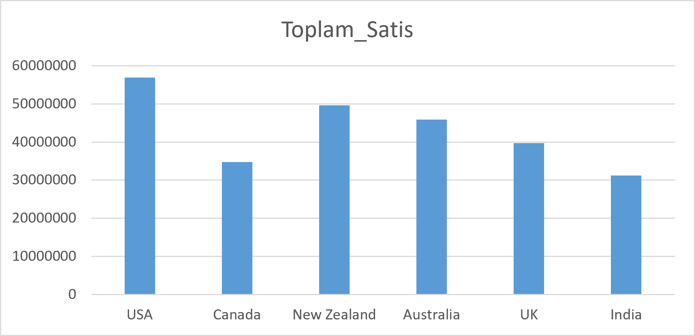
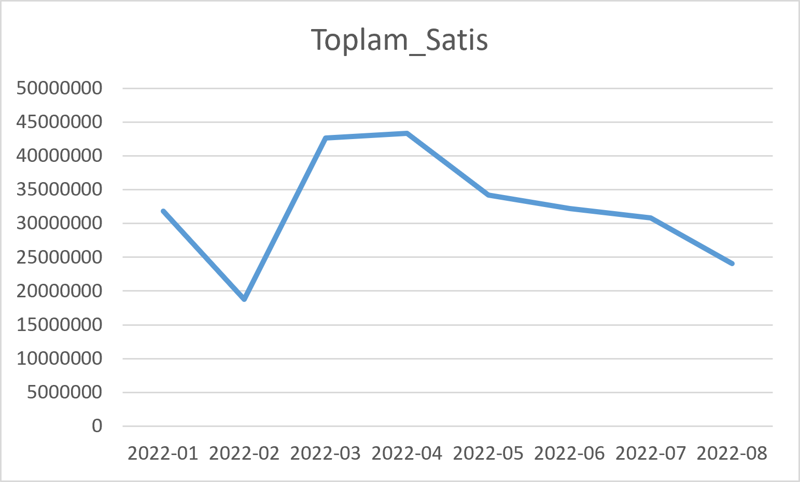

PureGlow: Marka Konumlandırma ve Rakip Analizi
Portföy Projesi — Bakım Sektörü Veri Analizi

1. Yönetici Özeti

Bu rapor, PureGlow markasının (kurgusal marka adı, gerçekçi satış verisi Kaggle'dan alınmıştır) 374 satış işlemini kapsayan iç verilerinin SQL ile analiz edilmesi ve sonuçların gerçek pazar liderleriyle (CeraVe, The Ordinary, Nivea) karşılaştırılması yoluyla veriye dayalı bir konumlandırma önerisi sunmaktadır.

**Temel Bulgu:** PureGlow, net bir kimliği olmayan "her şeyden biraz" bir portföy yapısına sahiptir — hem hacim liderleri hem premium ürünler hem de zayıf performanslı ürünler bir arada bulunmaktadır. Rakip analiziyle karşılaştırıldığında, markanın **hibrit bir konumlandırma stratejisi** (günlük temel ürünler + özel bakım hattı ayrımı) benimsemesi önerilmektedir.

2. Metodoloji ve Veri Kaynağı

- İç veri:  Kaggle "Cosmetics & Skincare Product Sales Data (2022)" veri seti, SQL Server'a aktarılmış, 374 satış kaydı (Ocak–Ağustos 2022, 6 ülke, 15 ürün, 10 satış temsilcisi).
- Önemli not: Bu veri setinde marka bilgisi bulunmadığından, tek bir şirketin çoklu ürün/ülke satışları "PureGlow" adlı kurgusal marka olarak ele alınmıştır. Bu, portföy projeleri için kabul gören bir yöntemdir ve şeffaflıkla belirtilmektedir.
- Dış veri: CeraVe, The Ordinary ve Nivea markalarının fiyatlandırma, konumlandırma ve pazar algısı bilgileri güncel web kaynaklarından derlenmiştir.
- Para birimi ve ölçek notu: Veri setinin `Amount` kolonunda para birimi simgesi belirtilmemiştir. Ülke dağılımı (USA, Canada, UK, Australia, New Zealand, India) ve rakamların büyüklüğü dikkate alınarak bu raporda tüm tutarlar **USD ($) varsayımıyla** ve tutarlı bir ölçekte (K = bin, M = milyon) sunulmuştur. Gerçek bir projede bu varsayım veri sağlayıcıyla teyit edilmelidir.
- Sınırlama: Veri seti 8 aylık bir dönemi kapsamaktadır; mevsimsellik yorumları bu nedenle temkinli yapılmalıdır. Ayrıca veri setinde gerçek maliyet/kâr marjı bilgisi yoktur; "ortalama işlem tutarı" bir vekil (proxy) gösterge olarak kullanılmıştır.

3. SQL Analiz Bulguları

Analizde kullanılan teknikler: `GROUP BY` ile kırılım, `SUM()`/`COUNT()`/`AVG()` ile toplam-hacim-ortalama üçlüsü, `FORMAT()` ile tarih kırılımı, ve `WHERE` ile filtrelenmiş kök neden analizi. Tüm sorgular [`sql/`](../sql/) klasöründe numaralandırılmış dosyalar halinde mevcuttur.

     3.1 Ürün Performansı

> SQL: [`sql/02_urun_performansi.sql`](../sql/02_urun_performansi.sql) — `GROUP BY Product` ile toplam ciro, işlem hacmi ve `AVG(Amount)` hesaplanmıştır.

| Ürün | Toplam Satış (Ciro) | İşlem Sayısı (Hacim) | Ortalama İşlem Tutarı |
|---|---:|---:|---:|
| Body Butter Cream | $20.94M | 24 | **$872.4K** |
| Tea Tree Moisturizer | **$24.47M** | **30** | $815.7K |
| Anti-Aging Serum | $22.11M | 29 | $762.5K |
| Face Sheet Masks | $17.50M | 23 | $760.8K |
| SPF 50 Sunscreen | $20.33M | 27 | $752.9K |
| Rose Water Toner | $12.59M | 17 | $740.4K |
| Under Eye Cream | $19.15M | 26 | $736.4K |
| Hydrating Face Serum | $22.03M | 31 | $710.8K |
| Lip Balm Pack | $17.01M | 24 | $708.8K |
| Aloe Vera Gel | $17.71M | 25 | $708.5K |
| Hair Repair Oil | $20.46M | 30 | $681.9K |
| Vitamin C Cream | $16.66M | 28 | $594.8K |
| Niacinamide Toner | $10.03M | 20 | $501.5K |
| Salicylic Acid Cleanser | $9.36M | 19 | $492.7K |
| Charcoal Face Wash | $7.61M | 21 | $362.5K (en düşük) |

**Segment özeti:**

| Segment | Ürünler | Toplam Ciro Payı |
|---|---|---|
| Hacim + Değer Lideri | Tea Tree Moisturizer, Body Butter Cream | $45.41M (toplam cironun ~%18'i, 2/15 üründen) |
| Orta Segment | Anti-Aging Serum, SPF 50 Sunscreen, Face Sheet Masks, Under Eye Cream, Hydrating Face Serum, Aloe Vera Gel | $118.87M |
| Zayıf Segment | Vitamin C Cream, Niacinamide Toner, Salicylic Acid Cleanser, Charcoal Face Wash | $43.66M |

Body Butter Cream, en yüksek ortalama işlem tutarına ($872.4K) sahip olmasına rağmen toplam satışta orta sırada yer almaktadır — klasik bir "premium/marj ürünü" profili sergilemektedir. Tea Tree Moisturizer ise hem hacimde hem ortalama değerde ilk 2'de yer alarak markanın gerçek "hero" ürünü konumundadır.

     3.2 Pazar (Ülke) Performansı

> SQL: [`sql/03_ulke_analizi.sql`](../sql/03_ulke_analizi.sql) — `GROUP BY Country` ile pazar kırılımı yapılmıştır.

| Ülke | Toplam Satış | İşlem Sayısı | Ortalama İşlem Tutarı |
|---|---:|---:|---:|
| USA | **$56.88M** | **75** | **$758.4K** |
| Canada | $34.79M | 47 | $740.1K |
| New Zealand | $49.59M | 73 | $679.3K |
| Australia | $45.85M | 70 | $655.0K |
| UK | $39.68M | 61 | $650.6K |
| India | $31.16M | 48 | $649.1K |

USA hem toplam satışta hem ortalama işlem değerinde açık ara liderdir. Kanada, en düşük işlem sayısına (47) sahip olmasına rağmen ikinci en yüksek ortalama işlem değerine ($740.1K) ulaşarak "niş ama değerli" bir pazar profili göstermektedir. New Zealand ve Australia ise yüksek işlem hacmine sahip ancak görece düşük ortalama değerli "hacim pazarları" olarak öne çıkmaktadır.
      3.3 Zaman Trendi

> SQL: [`sql/04_zaman_trendi.sql`](../sql/04_zaman_trendi.sql) — `FORMAT(Date, 'yyyy-MM')` ile aylık kırılım yapılmıştır.

| Ay | Toplam Satış | İşlem Sayısı |
|---|---:|---:|
| 2022-01 | $31.84M | 50 |
| 2022-02 | $18.78M (en düşük) | 25 |
| 2022-03 | $42.64M (zirve) | 58 |
| 2022-04 | $43.36M | 50 |
| 2022-05 | $34.22M | 49 |
| 2022-06 | $32.25M | 50 |
| 2022-07 | $30.81M | 48 |
| 2022-08 | $24.07M | 44 |

Ocak–Ağustos 2022 döneminde Mart ayı satış zirvesi ($42.64M) görülürken, Şubat'ta belirgin bir düşüş ($18.78M) yaşanmıştır.

> SQL: [`sql/05_satis_temsilcisi_subat.sql`](../sql/05_satis_temsilcisi_subat.sql) — `WHERE` ile Şubat'a filtrelenmiş, `GROUP BY Sales_Person` ile kök neden aranmıştır.

Bu düşüşün tek bir satış temsilcisinden kaynaklanmadığı tespit edilmiştir: 10 temsilcinin tamamı Şubat'ta 1–4 işlem arasında (ortalama ~2.5 işlem/kişi) çalışmıştır, hiçbiri sıfır işlem yapmamış veya aşırı öne çıkmamıştır. Bu, ekip genelinde yaşanan bir yavaşlamaya işaret etmektedir — kök neden veri setinde yer almadığından, olası mevsimsellik veya kampanya eksikliği olarak yorumlanmaktadır. Nisan sonrası Ağustos'a kadar kademeli bir düşüş eğilimi de gözlemlenmiştir.

4. Rakip Marka Analizi

| Marka | Fiyat Aralığı | Konumlandırma | Güçlü Yön | Zayıf Yön |
|---|---|---|---|---|
| CeraVe | $15–20 (temel), $30+ (premium) | Dermatolojik/klinik, güvenilir | Bütçe segmentinde yüksek memnuniyet | $30 üzeri üründe puan düşüyor |
| The Ordinary | $5–20 (çoğu <$10) | Aktif içerik, radikal şeffaflık | Net, tek mesajlı konumlandırma | Marka deneyimi/duygusal bağ zayıf |
| Nivea | Kitlesel-düşük, premium hatlarda orta | Aile, güven, her yerde bulunabilirlik | Geniş ürün yelpazesi, global erişim | Genç/dijital tüketiciyle bağ zayıf |

5. SWOT Analizi — PureGlow

Güçlü Yönler (Strengths)
- Tea Tree Moisturizer gibi hem hacimli hem değerli bir hero ürüne sahip
- USA pazarında güçlü, dengeli bir performans
- Ürün portföyünde hem hacim hem premium segmentte varlık

Zayıf Yönler (Weaknesses)
- Net bir marka kimliği/konumlandırma mesajı yok (CeraVe'nin kliniği veya The Ordinary'nin şeffaflığı gibi)
- Charcoal Face Wash, Niacinamide Toner gibi hem hacim hem değerde zayıf ürünler portföyü seyreltiyor (toplam cironun ~%14'ü, en düşük performanslı 4 üründen geliyor)
- Şubat ayındaki genel yavaşlamanın kök nedeni bilinmiyor — talep tahmini/planlama riski

Fırsatlar (Opportunities)
- Kanada gibi düşük hacimli ama yüksek değerli pazarlarda niş/premium konumlandırma potansiyeli
- Body Butter Cream'i CeraVe'nin bütçe-dostu-ama-etkili modeline benzer şekilde "erişilebilir premium" olarak öne çıkarma
- New Zealand/Australia'daki yüksek işlem hacmini hacim ürünleriyle (Tea Tree Moisturizer, Aloe Vera Gel) daha agresif hedefleme

Tehditler (Threats)
- The Ordinary ve CeraVe gibi net konumlandırmaya sahip rakipler karşısında "kimliksiz" kalma riski
- Nivea'nın geniş erişimi ve marka güveniyle kitlesel segmentte rekabet zorluğu
- Zayıf performanslı ürünlerin portföyde kalmaya devam etmesi kaynak israfına yol açabilir

6. Konumlandırma Önerisi: Hibrit Strateji

Veri, PureGlow'un tek bir rakibi taklit etmek yerine **iki katmanlı bir portföy stratejisi** izlemesini desteklemektedir:

1. "PureGlow Essentials" (Günlük Temel Hat): Tea Tree Moisturizer, Aloe Vera Gel gibi hacimli ürünler — CeraVe'nin "etkili ve erişilebilir" konumlandırmasına yakın, geniş pazarlarda (New Zealand, Australia, UK) agresif fiyat/hacim stratejisiyle büyütülmeli.

2. "PureGlow Signature" (Premium Bakım Hattı): Body Butter Cream gibi yüksek ortalama değerli ürünler — Kanada ve USA'daki "değerli işlem" eğilimine paralel olarak, daha yüksek fiyat/daha düşük hacim stratejisiyle premium bir alt-hat olarak konumlandırılmalı.

3. Portföy Sadeleştirme: Charcoal Face Wash, Niacinamide Toner gibi hem hacim hem değerde zayıf kalan ürünler için yeniden formülasyon veya kademeli çıkış değerlendirilmelidir.

Bu yaklaşım, Nivea'nın geniş erişimini korurken CeraVe/The Ordinary'nin net segment mesajlarından ilham alan, veri destekli bir orta yol sunmaktadır.

7. Aksiyon Planı ve Başarı Metrikleri

Stratejinin soyut kalmaması için önerilen uygulama takvimi ve ölçüm kriterleri:

* 0–3. Ay — Pilot Aşama
- "PureGlow Signature" alt-markasını yalnızca Body Butter Cream ile USA ve Kanada pazarlarında pilot olarak lansmanlamak (en yüksek ortalama işlem değerine sahip 2 pazar).
- Charcoal Face Wash ve Niacinamide Toner için fiyat/formül testi başlatmak; kademeli tasfiye (phase-out) kararı için veri toplamak.
Hedef KPI: Pilot pazarlarda ortalama sepet tutarında (ortalama işlem tutarı) **%10–15 artış**.

* 3–6. Ay — Ölçekleme
- Pilotta başarılı olursa "Signature" hattını Australia/UK'ya genişletmek; "Essentials" hattını New Zealand/Australia'da hacim odaklı kampanyalarla desteklemek.
- Zayıf segment ürünlerinden performansı iyileşmeyenler için resmi tasfiye planı devreye almak.
- Hedef KPI: Zayıf segment ürünlerinin toplam ciro içindeki payının **%14'ten %8'in altına** indirilmesi; stok devir hızında (işlem sıklığı, `Islem_Sayisi`) iyileşme.

* 6. Ay ve sonrası — Değerlendirme
- Şubat-tipi genel yavaşlamaların tekrarını izlemek için aylık trend takibi kurumsallaştırılmalı (erken uyarı eşiği: bir önceki 3 ayın ortalamasına göre %30+ düşüş).
- Hedef KPI: Yıllık toplam ciroda bir önceki döneme göre **%8–12 büyüme**, hero ürünün (Tea Tree Moisturizer) pazar payını koruması.

8. Sınırlamalar

- Veri seti simüle edilmiş olup gerçek bir markanın iç verisi değildir; bulgular metodoloji gösterimi amaçlıdır.
- 8 aylık veri, güçlü mevsimsellik veya yıllık trend analizi için yeterli değildir.
- Para birimi varsayımı (USD) veri sağlayıcı tarafından teyit edilmemiştir.
- Rakip verileri kamuya açık kaynaklardan derlenmiştir, gerçek zamanlı fiyat/pazar payı verisi içermez.
- Aksiyon planındaki KPI hedefleri (%10-15, %8-12 vb.) sektör ortalamalarına dayalı makul varsayımlardır, PureGlow'a özgü tarihsel karşılaştırma verisi değildir.

